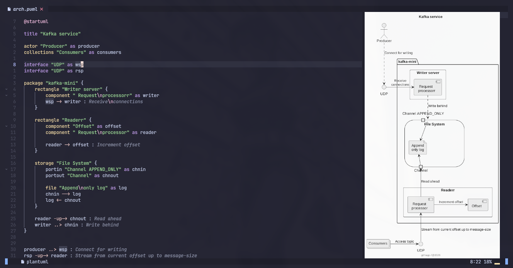

# PlantUML.nvim

This is a previewer for plantuml diagrams. It doesn't render images in your neovim, you need another plugin for that.



## Usage

```lua
-- Toggle previewer with current plantuml buffer
-- :PlantumlPreviewToggle

-- Open previewer with current plantuml buffer
-- :PlantumlPreviewOpen
 
-- Close previewer
-- :PlantumlPreviewClose

-- you can setup a mapping so that gets easier
vim.keymap.set('n', '<Leader>puml', ":PlantumlPreviewToggle<cr>")
```

