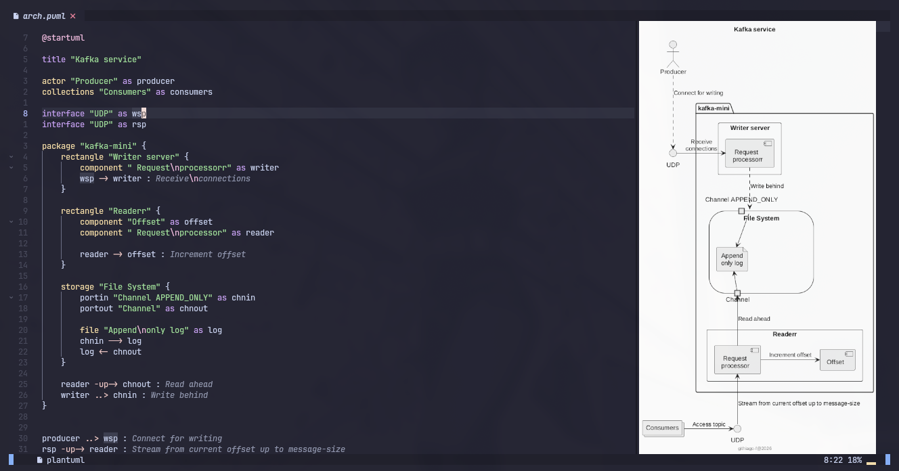

# plantuml.nvim

A PlantUML diagram previewer for Neovim. Renders `.puml` files to PNG/SVG and displays them in a vertical-split preview window with auto-reload.



## Features

- Render PlantUML diagrams to PNG, SVG, or Unicode art (`utxt`)
- **Multi-diagram support** — cycle through multiple `@startuml`/`@enduml` blocks in one file
- **Zoom in/out** — scale the preview image without resizing the split
- Vertical-split preview window (configurable width)
- Auto-reload on save or edit (debounced)
- Proper image rendering via [image.nvim](https://github.com/3rd/image.nvim) (Kitty protocol, Sixel, or Überzug++)
- No post-render file churn: each render writes to its own temp dir, so reloads never race with image.nvim

## Prerequisites

| Tool | Required | Notes |
|---|---|---|
| **Java** (JRE) | Yes | PlantUML is Java-based |
| **PlantUML CLI** | Yes | `plantuml` command on `$PATH` |
| **ImageMagick** | Yes | For image processing (used by image.nvim) |

### Installing dependencies

**Arch Linux**
```bash
sudo pacman -S jdk-openjdk plantuml imagemagick
```

**Ubuntu/Debian**
```bash
sudo apt install default-jre plantuml imagemagick
```

**macOS**
```bash
brew install plantuml imagemagick
```

## Image Rendering Setup

This plugin generates diagram images but does **not** render them in Neovim buffers on its own. For actual image display you need one of the following setups:

### Option A: Kitty terminal + image.nvim (recommended)

Use [Kitty](https://sw.kovidgoyal.net/kitty/) (v28+) with the [image.nvim](https://github.com/3rd/image.nvim) plugin for the best experience.

1. Install the Kitty terminal emulator
2. Install `image.nvim` via your plugin manager:

   **lazy.nvim**
   ```lua
   {
     "3rd/image.nvim",
     opts = {
       processor = "magick_cli", -- or "magick_rock" for better perf
     },
   }
   ```

   **vim.pack.add** (native)
   ```lua
   vim.pack.add({ "https://github.com/3rd/image.nvim" })
   require("image").setup({
     processor = "magick_cli",
   })
   ```

   **packer.nvim**
   ```lua
   use({
     "3rd/image.nvim",
     config = function()
       require("image").setup({ processor = "magick_cli" })
     end,
   })
   ```

3. Verify it works by running `nvim some-image.png` — it should render inline.

> **Note**: If you use Tmux, ensure `set -gq allow-passthrough on` and `set -g visual-activity off` in your `tmux.conf`.

### Option B: Sixel-compatible terminal

If your terminal supports Sixel (e.g., XTerm, foot, WezTerm), configure `image.nvim` with the Sixel backend:

```lua
require("image").setup({
  backend = "sixel",
  processor = "magick_cli",
})
```

### Option C: Überzug++

Works with any terminal via [ueberzugpp](https://github.com/jstkdng/ueberzugpp):

```bash
# Arch
sudo pacman -S ueberzugpp
```

```lua
require("image").setup({
  backend = "ueberzug",
  processor = "magick_cli",
})
```

## Optional: PlantUML syntax highlighting

Syntax highlighting (and `.puml`/`.plantuml`/`.pu` filetype detection) comes from the Vim-based [aklt/plantuml-syntax](https://github.com/aklt/plantuml-syntax) plugin. It is **not** required for the preview to work — `plantuml.nvim` only gates on filetypes, which you can also set manually — but it makes editing diagrams much nicer:

```lua
vim.pack.add({ "https://github.com/aklt/plantuml-syntax" })
vim.cmd.packadd("plantuml-syntax")
```

If you use a plugin manager instead, add it the same way you add any other plugin.

## Installation

### lazy.nvim

```lua
{
  "githiago-f/plantuml.nvim",
  dependencies = { "3rd/image.nvim" }, -- optional but recommended
  opts = {
    output = { format = "png" },
    cmd = { exec = "plantuml", debounce_ms = 2000 },
  },
  keys = {
    { "<leader>puml", "<cmd>PlantumlPreviewToggle<CR>", desc = "Toggle PlantUML preview" },
  },
}
```

### vim.pack.add (native)

```lua
vim.pack.add({ "https://github.com/githiago-f/plantuml.nvim" })

require("plantuml").setup({
  output = {
    format = "png",
    window_size = 70,
  },
  cmd = {
    exec = "plantuml",
    debounce_ms = 2000,
    temp_dir = "/tmp/nvim-plantuml",
  },
})
```

### packer.nvim

```lua
use({
  "githiago-f/plantuml.nvim",
  config = function()
    require("plantuml").setup({
      output = { format = "png" },
    })
  end,
})
```

## Configuration

`require("plantuml").setup({...})` accepts an optional table with the following defaults:

```lua
{
  output = {
    format = "png",       -- "png", "svg", or "utxt"
    window_size = 70,     -- width of the vertical-split preview window
  },
  cmd = {
    exec = "plantuml",    -- path or command for the PlantUML CLI
    debounce_ms = 2000,   -- auto-reload debounce (milliseconds)
    temp_dir = "/tmp/nvim-plantuml", -- temporary directory for rendered files
  },
  zoom = {
    step = 0.25,          -- amount zoom in/out changes the scale
    min = 0.25,           -- minimum zoom factor
    max = 4,              -- maximum zoom factor
    pan_step = 2,         -- cells moved per keyboard pan
  },
}
```

## Commands

| Command | Action |
|---|---|
| `:PlantumlPreviewToggle` | Open preview if closed, close if open |
| `:PlantumlPreviewOpen`   | Open/render preview for current buffer |
| `:PlantumlPreviewClose`  | Close the preview window |
| `:PlantumlPreviewNext`   | Next diagram (multi-diagram files) |
| `:PlantumlPreviewPrev`   | Previous diagram (multi-diagram files) |
| `:PlantumlPreviewZoomIn` | Zoom in on the preview image |
| `:PlantumlPreviewZoomOut`| Zoom out of the preview image |
| `:PlantumlPreviewZoomReset` | Reset preview zoom to 1x |
| `:PlantumlPreviewPanUp` | Pan the focused viewport up (when zoomed in) |
| `:PlantumlPreviewPanDown` | Pan the focused viewport down |
| `:PlantumlPreviewPanLeft` | Pan the focused viewport left |
| `:PlantumlPreviewPanRight` | Pan the focused viewport right |
| `:PlantumlPreviewGoto` | Jump to a diagram by index or name (`:PlantumlPreviewGoto Login Flow`) |

> Zoom only scales the image; it never resizes the preview split.
> `zoom = 1` (default) fits the whole diagram inside the preview window; zoom
> out shrinks it. Above `zoom = 1` the preview shows a window-sized, magnified
> crop of the diagram instead of an overflowing image: **zoom in/out keeps the
> current viewport center fixed**, and `:PlantumlPreviewPan*` or mouse-dragging
> in the preview window moves the focused part around.
>
> Named diagrams (`@startuml Name`) are included in `Next`/`Prev` cycling and
> reachable via `:PlantumlPreviewGoto`; the preview statusline shows the
> current diagram name, index, and zoom.

## Keymaps

```lua
-- Toggle preview
vim.keymap.set("n", "<leader>puml", "<cmd>PlantumlPreviewToggle<CR>", {
  desc = "Toggle PlantUML preview",
})

-- Cycle through diagrams (multi-diagram files)
vim.keymap.set("n", "<leader>pun", "<cmd>PlantumlPreviewNext<CR>", {
  desc = "Next PlantUML diagram",
})
vim.keymap.set("n", "<leader>pup", "<cmd>PlantumlPreviewPrev<CR>", {
  desc = "Previous PlantUML diagram",
})

-- Zoom the preview image
vim.keymap.set("n", "<leader>pzi", "<cmd>PlantumlPreviewZoomIn<CR>", {
  desc = "Zoom in PlantUML preview",
})
vim.keymap.set("n", "<leader>pzo", "<cmd>PlantumlPreviewZoomOut<CR>", {
  desc = "Zoom out PlantUML preview",
})

-- Pan the focused viewport while zoomed in
vim.keymap.set("n", "<leader>puu", "<cmd>PlantumlPreviewPanUp<CR>", {
  desc = "Pan PlantUML preview up",
})
vim.keymap.set("n", "<leader>pud", "<cmd>PlantumlPreviewPanDown<CR>", {
  desc = "Pan PlantUML preview down",
})
vim.keymap.set("n", "<leader>pul", "<cmd>PlantumlPreviewPanLeft<CR>", {
  desc = "Pan PlantUML preview left",
})
vim.keymap.set("n", "<leader>pur", "<cmd>PlantumlPreviewPanRight<CR>", {
  desc = "Pan PlantUML preview right",
})
```

## Usage Walkthrough

1. Open a `.puml` (or `.plantuml`, `.pu`) file — or set `filetype=puml` on any buffer
2. Run `:PlantumlPreviewOpen` or your mapped key
3. A vertical-split preview window opens on the right showing the rendered diagram
4. Edit the source — the preview auto-reloads after a short debounce (default 2s)
5. For files with multiple `@startuml`/`@enduml` blocks, use `:PlantumlPreviewNext` / `:PlantumlPreviewPrev` to cycle through diagrams
6. Use `:PlantumlPreviewZoomIn` / `:PlantumlPreviewZoomOut` to magnify the image
7. Run `:PlantumlPreviewToggle` to close/reopen as needed

## How It Works

```
Edit .puml file
      │
      ▼
TextChanged / BufWritePost
      │
      ▼
watcher (debounce ~2s)
      │
      ▼
renderer: write buffer → temp source <temp_dir>/<bufnr>.puml
          ↓
          plantuml <src> -nometadata -t<png> -o <temp_dir>/<bufnr>_<render-id>
          ↓
          on_exit → collect <bufnr>.png / <bufnr>_NNN.png from the render dir
      │
      ▼
preview: open/reload vertical split window
         └─ image.nvim renders PNG in buffer (if available)
```

Render outputs land in a fresh `<temp_dir>/<bufnr>_<render-id>/` directory per render and are only removed when the preview closes. That way image.nvim never re-identifies a file that was deleted mid-edit, and stale callbacks from an older render are dropped.

## Troubleshooting

| Symptom | Likely cause | Fix |
|---|---|---|
| `plantuml.nvim: 'plantuml' not found on PATH` | PlantUML CLI not installed | Install Java + PlantUML (see prerequisites) |
| `plantuml.nvim: render failed with exit code 1` | PlantUML syntax error | Check your diagram source for errors |
| Preview shows raw binary text | No image rendering plugin | Install `image.nvim` (see Image Rendering Setup) |
| Image not updating after edit | Debounce timer not expired | Wait 2s or adjust `cmd.debounce_ms` |
| Preview says "not a PlantUML buffer" | Wrong filetype | Ensure buffer has `filetype=puml` / `.puml` extension |
| Multiple diagrams but `Next`/`Prev` does nothing | Single-diagram file or preview not open | Check the file has multiple `@startuml` blocks and preview is active |

## Testing

Run the spec suite (uses `plantuml -tutxt` text output, so no terminal/image plugin needed):

```bash
./tests/run.sh
```

## License

MIT
